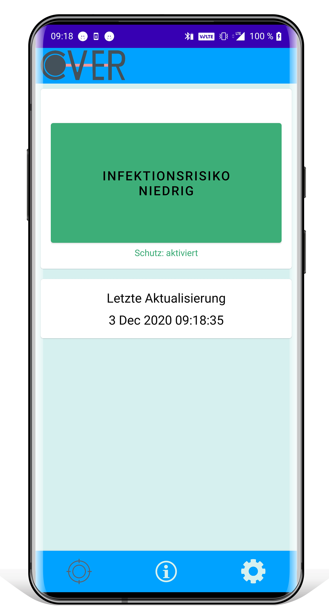
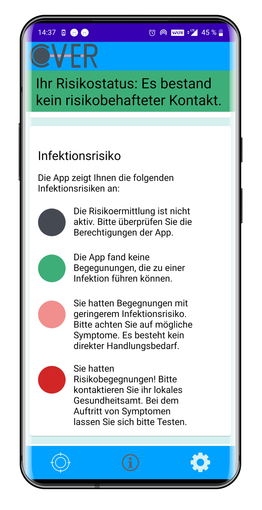

**Important:** This is a student project and not an alternative to official COVID-19 apps. Please use the official app of your country https://en.wikipedia.org/wiki/COVID-19_apps#List_of_apps_by_country

# CoVer
## What is CoVer?

CoVer stands for SARS-**Co**V-2 Nach**ve**rfolgung, which means COVID Tracing in English.
This project is conducted within the lecture Laboratories for Software Development at the Heilbronn University of Applied Sciences.

The project includes the Android application, the backend and Docker Compose files to deploy it on a linux server.

For more information, please visit our website https://boslx.github.io/CoVer/ (German).

## Screenshots

